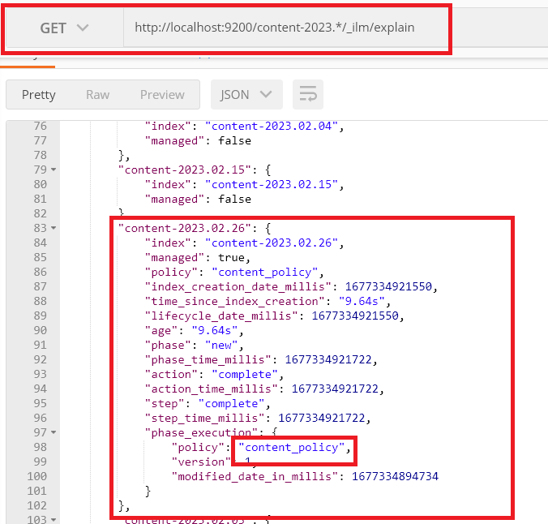
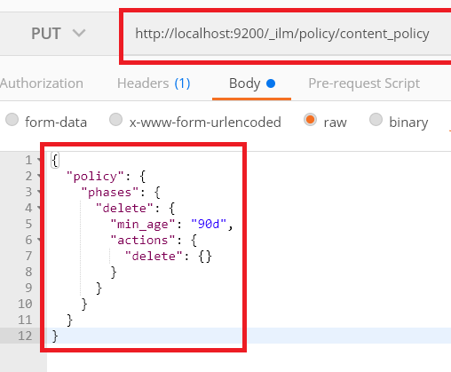
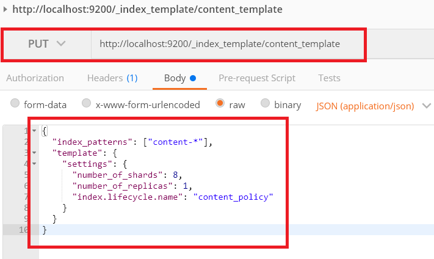

1) Маппінг індексу по патерну - content-*
2) Індексування:
- Шукаємо ід по патерну content-*
- Якщо знайшли - видаляємо із знайденого індексу
- індексуемо по паетрну content-{now/d}
3) Серч:
- серч виконуємо па патерну [content-[{now/M} - 3*]..., content-[{now/M}*]]

4) ILM налаштування: робило налаштування на видалення індексу більше 90 днів:
   https://www.elastic.co/guide/en/elasticsearch/reference/7.14/ilm-put-lifecycle.html

